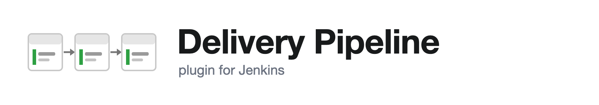
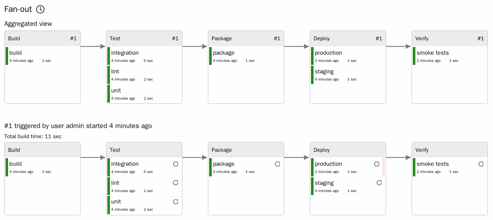

Delivery Pipeline Plugin
========================



[](https://ci.jenkins.io/job/Plugins/job/delivery-pipeline-plugin/job/master/)
[](https://plugins.jenkins.io/delivery-pipeline-plugin/)

The Delivery Pipeline plugin visualises delivery pipelines in Jenkins: chains of jobs with upstream/downstream
dependencies, and Pipeline (Jenkinsfile) jobs. It is made for information radiators (there is a full screen page)
and for everyday use next to the jobs.

Plugin documentation: [plugins.jenkins.io/delivery-pipeline-plugin](https://plugins.jenkins.io/delivery-pipeline-plugin/).
Bugs and feature requests go to the [Jenkins issue tracker](https://issues.jenkins.io/issues/?jql=component%20%3D%20delivery-pipeline-plugin),
component `delivery-pipeline-plugin`.

This plugin was contributed to the community by [Diabol AB](https://www.diabol.se).



Version 2.0
-----------

2.0 is a rewrite of the plugin on the Jenkins 2.555 LTS baseline and Java 21. Existing views, jobs and Job DSL
scripts keep working; what changed is underneath and around them.

**What stays the same**

- The view type, `Delivery Pipeline View`, with the same persisted configuration. Views created by 1.x and by Job
  DSL's `deliveryPipelineView { ... }` load unchanged.
- The `Delivery Pipeline configuration` job property (stage name, task name, description template) and the
  `deliveryPipelineConfiguration` Job DSL call.
- The `Create Delivery Pipeline version` build wrapper with its `PIPELINE_VERSION` variable and token.
- The URLs: the view page, `?fullscreen=true` for the wall board page, `?component=N&page=P` for paging.

**What is new**

- One view type for both kinds of pipelines. A component of a view points at the first job of a chain, or at a
  Pipeline job. The "Delivery Pipeline View for Jenkins Pipelines" of 1.x is gone as a type; a saved one is turned
  into a Delivery Pipeline View with the same components when Jenkins loads it.
- Pipeline jobs are read from the run's flow graph. Every top-level stage is a stage; the stages nested in it, or
  else its parallel branches, are its tasks. Declarative `parallel` and `matrix` blocks render one task per branch.
  No `task` step is needed; the step of 1.x is deprecated but still works, shows its block as a task as before,
  and prints a reminder to use a nested `stage`.
- The view model is a set of immutable records with one documented JSON contract, served by `<view>/api/json`
  (see `se.diabol.jenkins.pipeline.model`). The page script renders that JSON; it uses no third-party libraries
  and no page globals, works under a Content-Security-Policy and follows the Jenkins theme, dark themes included.
- Computed models are cached for a short while and dropped whenever a build starts, ends or is deleted, the queue
  changes or a job is reconfigured, so many wall boards polling the same view cost little more than one.
- Actions the page posts (start, manual trigger, rebuild, abort, proceed input) are checked on the server against the
  view's settings and the user's permissions; buttons only appear for users who may use them.
- Task descriptions are rendered through the markup formatter configured for Jenkins, exactly like job
  descriptions. To use HTML in description templates, configure a formatter that allows it (for example the
  OWASP Markup Formatter plugin with "Safe HTML").
- Stages are laid out by the longest path from the first stage, so arrows always point to the right.
- Pipeline runs can be run again with the same parameters from the button next to the run's heading. Declarative
  runs can also be restarted from any of their stages, from the button of the stage's task, through the "Restart
  from Stage" feature of the Pipeline: Declarative plugin when it is installed.
- Test results recorded by a `junit` step inside a stage or a parallel branch show on that task. Warnings Next
  Generation results of a Pipeline run belong to the run as a whole and show under the run's heading.
- Only the stages a Jenkinsfile declares are shown; the stages Declarative Pipeline generates around them
  ("Declarative: Checkout SCM", "Post Actions", "Tool Install") are left out, and test results recorded there, or
  anywhere outside the tasks shown, are listed under the run's heading. A run waiting in the queue is shown before it
  starts, laid out like the previous run. A task waiting at an input step with parameters links to the input page,
  since only that page can collect them; one without parameters is proceeded from the view.
- When the Pipeline Graph View plugin is installed (it is one of the plugins a fresh Jenkins suggests), every stage,
  nested stage and parallel branch links to its own log in that plugin's console page. Without it, a running stage
  links to the run's console and a finished one to the run.
- A *Delivery Pipeline manual step* post-build action of its own, so manual steps no longer need the Build
  Pipeline plugin.
- The required dependencies are plugins a fresh Jenkins installs with its suggested set (Pipeline: Job,
  Pipeline: API, Pipeline: Input Step, JUnit, Token Macro, Structs) plus Pipeline Graph Analysis, the small library
  that reads stage status and timing from a run's flow graph; the plugin manager installs it alongside. Everything
  else is optional and activates when the plugin is present: Build Pipeline (manual triggers), Promoted Builds
  (promotions, promotion-triggered jobs), Warnings Next Generation (static analysis results), Parameterized Trigger
  (blocking sub-projects), Pipeline: Declarative (restart from stage), Pipeline Graph View (a log per stage).

Two limits of the Pipeline support: a `parallel` nested inside a parallel branch folds into that branch's task,
and a multibranch project needs a component per branch, by name or with a regular expression such as
`app/(.*)`, rather than being discovered as a whole.

**What was removed** (settings of 1.x that 2.0 ignores when loading an old view)

- Custom CSS URLs (`embeddedCss`, `fullScreenCss`) and themes: the view follows the Jenkins theme instead.
- `showAvatars`, `linkRelative` and `linkToConsoleLog`: links are always relative to the Jenkins root and running
  tasks always link to their console.
- The aggregated change log (`showAggregatedChanges`, `aggregatedChangesGroupingPattern`).
- The Dashboard View portlet.

Requirements
------------

Delivery Pipeline plugin 2.0 requires Jenkins 2.555.3 or later and Java 21.

Delivery Pipeline plugin 1.5 and 1.6 require Java 17 and Jenkins 2.541.2 or later; 1.4.0 and later require Java 8
and Jenkins 2.164 or later.

Configuring a view
------------------

Create a view of type `Delivery Pipeline View`. Under *Pipelines*, add a component per pipeline: a name and the
initial job. For a chain of jobs the view follows the downstream dependencies of the initial job (build triggers,
parameterized triggers, promotions); an optional final job stops the chain there. Alternatively a regular expression
over job names creates one component per match, named by the expression's capture group.

Jobs are grouped into stages by the *Delivery Pipeline configuration* property of each job: jobs with the same
stage name share a stage, and the task name is what the job's box says. Without the property, the job's display name
is used for both.

The *Display* and *Actions* sections control what the view shows (aggregated pipeline, change log, descriptions,
test results, static analysis results, promotions, total build time, paging, columns, sorting) and what the page
lets users do (start a pipeline, trigger manual steps, rebuild a task, abort a build).

The same options are available from Job DSL:

```groovy
deliveryPipelineView('Ancestry') {
    pipelineInstances(4)
    showAggregatedPipeline()
    enablePaging()
    showChangeLog()
    showDescription()
    showTotalBuildTime()
    allowPipelineStart()
    allowRebuild()
    enableManualTriggers()
    updateInterval(45)
    pipelines {
        component('Ancestry', 'Ancestry_Automated/build')
    }
}
```

Manually triggered tasks
------------------------

Add the *Delivery Pipeline manual step* post-build action to a job and list the jobs a person starts by hand. They
show up downstream of the job in the view, nothing starts them automatically, and with *Allow manual triggers*
enabled each one gets a play button once the upstream build has finished, for users who may build it. The build
that is started gets the upstream build's parameters where the job defines them, the job's defaults for the rest,
and belongs to the same pipeline instance. From Job DSL:

```groovy
job('build') {
    publishers {
        deliveryPipelineManualStep {
            downstreamProjectNames('deploy_staging, deploy_production')
        }
    }
}
```

Jobs listed in the [Build Pipeline plugin](https://plugins.jenkins.io/build-pipeline-plugin/)'s *Build other
projects (manual step)* action are recognised in the same way when that plugin is installed. Pipeline runs waiting
at an `input` step show a button that lets them proceed.

The JSON API
------------

`<view>/api/json` returns the components with their pipelines, stages and tasks, plus the view's settings. The
contract is documented in the `se.diabol.jenkins.pipeline.model` package. Timestamps are epoch milliseconds,
durations are milliseconds and URLs are relative to the Jenkins root. The page polls this endpoint every
*update interval* seconds.

Performance and caching
-----------------------

Computing a view means walking the build history of every job in its pipelines, or the flow graph of every run
of a Pipeline job. The plugin does that once per view and page, keeps the result in memory, and serves it to
every browser that polls the view; only the per-user facts (whether the buttons may be shown) are added when the
JSON is written. Each cached model remembers the jobs it shows: when a build of one of them starts, ends or is
deleted, or one of them enters or leaves the queue, only the models showing that job are dropped, so a busy
controller does not recompute every board on every event. A job being created, reconfigured, renamed or deleted
empties the cache, because that can change which jobs belong to which pipeline. Between events an entry is served
for a limited time:

| System property | Default | Applies to |
|---|---|---|
| `se.diabol.jenkins.pipeline.cache.ModelCache.idleSeconds` | 30 | a view in which nothing is running or queued |
| `se.diabol.jenkins.pipeline.cache.ModelCache.activeSeconds` | 2 | a view with a running or queued build |

The active limit bounds how stale a progress bar or the stages of a running Pipeline can be, because stages come
and go without any of the events above. The idle limit only matters for a controller where builds are rare and the
views are large. Zero turns the cache off, which is useful when measuring.

Set the properties at startup with the Java options of the controller, for example
`-Dse.diabol.jenkins.pipeline.cache.ModelCache.activeSeconds=5`, or change them at runtime from the script console
with `System.setProperty(...)`: they are read on every request. Raise `activeSeconds` when many wall boards show
Pipeline jobs that run for a long time; raise `idleSeconds` when large chains of jobs are shown on many screens and
builds are rare. The *update interval* of each view is the other knob: polls that arrive within the cached time
cost almost nothing, so a short interval is fine as long as the limits above fit the controller.

To see what a view costs, time `<view>/api/json` twice: the first answer after an event is the computation, the
second one is the cache. On a controller with views of several hundred tasks the first takes a few seconds and
the second a fraction of one.

Finished Pipeline runs are analysed once and remembered separately until they are deleted, so a Pipeline job with
a long history costs the flow graph walk only for the runs that are still going on.

Building the project
--------------------

Only Docker is needed. Maven and the JDK run in a container, with the Maven repository cached in `docker/.m2`:

    docker/run.sh build        # target/delivery-pipeline-plugin.hpi, ready to upload to a controller
    docker/run.sh test         # the test suite and SpotBugs (mvn verify) in the container
    docker/run.sh mvn hpi:run  # any other Maven command, here a local Jenkins with the plugin

The test suite renders the view in HtmlUnit with JavaScript enabled and takes a few minutes. With Java 21 and
Maven 3.9 installed, `mvn clean verify` works as usual, and `LOCAL_MAVEN=1 docker/run.sh ...` uses that Maven.

Testing against a real controller
---------------------------------

    docker/run.sh all

builds the plugin and a Jenkins 2.568.3 image with it, seeds a folder of chains and Pipeline jobs that exercise
every feature (fan-out, fan-in, manual steps of both kinds, failures, a disabled job, a matrix job, an eight-stage
chain, parallel and nested stages, an `input` gate, unstable and skipped stages), runs `docker/validate.py` against
it, which checks every view's JSON and page and performs every action the page can post, and captures light, dark,
full screen and phone screenshots into `docker/out/`. `docker/upgrade.sh` upgrades a controller from 1.4.2 to
this checkout on one Jenkins home and checks what loaded. See [docker/README.md](docker/README.md).
